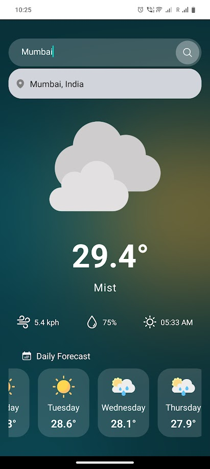

# Weather App - Personal Project - React native ☁️

This is an [Expo](https://expo.dev) project created with [`create-expo-app`](https://www.npmjs.com/package/create-expo-app).

## Get started

1. Install dependencies

   ```bash
   npm install
   ```

2. Start the app

   ```bash
    npm start // this already has the npm run expo start as the alias
   ```

## App Screenshots :



- UI view

# - Key takeaways :

1. Use native-wind - tailwindcss utility for the react-native
2. Environment variables in react native are auto imported by expo if they have the `EXPO_PUBLIC_[KEY_NAME]` as the key in the `.env` file. and can be extracted via `process.env.EXPO_PUBLIC_[KEY_NAME]` - acceessible in all JS parts of the program but not in the native part.
3. dotenv does not directly work like in case of nodejs - as here HERMES is used under the hood and - two other trivial ways. 1. react-native-dotenv -- js functions only 2. react-native-config accessible in both js and native parts of the code.
4. debounce -- from lodash implemented to throttle API calls while searching
5. react-native-async-storage -- to save the last state of the app and show that when the user reloads the app anytime.
6. useEffect to handle the reactivity and onMount functionalities as well as handling any async await code outside the useEffect as no cleanup function provided by default.
7. React native weird behaviour -- The keyboard shifts the whole view up on android - inside app.json use this to avoid this. Similar error appeared while developing FUTY - homescreen which had the sign up button being pushed up on android.

```
    "android": {
      // ...
      "softwareKeyboardLayoutMode": "pan",
    }
```

KeyboardAvoidingView is another component that can wrap this entire component - did not work for this project
